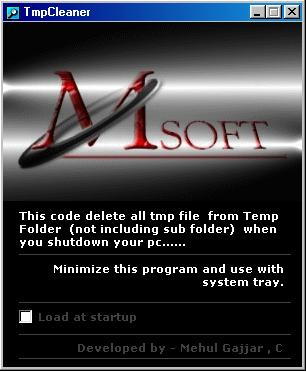



## Temp File Cleaner

### Description

This code is delete .tmp file in your windows temp folder (not includeing Subfolder).

when you shutdown your pc at this time it will delete automatic .tmp file in your temp folder.
 
### More Info
 
You can use this code by system try. so it will run in background.

No Side Effect.

             |
---                |---
**Submitted On**   |2006-03-26 12:07:06
**By**             |[Mehul Gajjar](https://github.com/Planet-Source-Code/PSCIndex/blob/master/ByAuthor/mehul-gajjar.md)
**Level**          |Advanced
**User Rating**    |3.7 (11 globes from 3 users)
**Compatibility**  |VB 5\.0, VB 6\.0
**Category**       |[Complete Applications](https://github.com/Planet-Source-Code/PSCIndex/blob/master/ByCategory/complete-applications__1-27.md)
**World**          |[Visual Basic](https://github.com/Planet-Source-Code/PSCIndex/blob/master/ByWorld/visual-basic.md)
**Archive File**   |[Temp\_File\_2007247172006\.zip](https://github.com/Planet-Source-Code/mehul-gajjar-temp-file-cleaner__1-65999/archive/master.zip)

